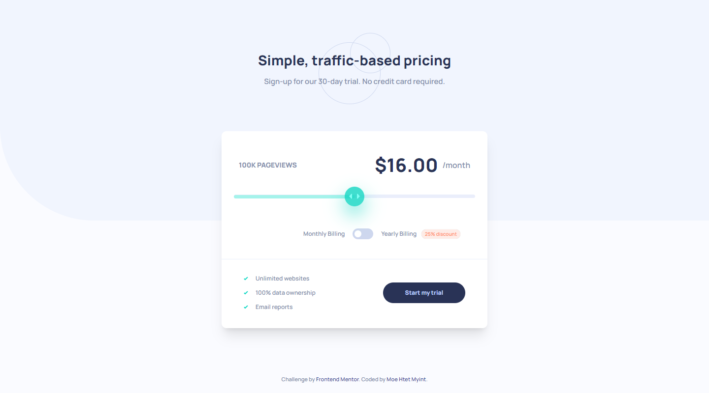

# Frontend Mentor - Interactive pricing component solution

## Table of contents

- [Overview](#overview)
  - [The challenge](#the-challenge)
  - [Screenshot](#screenshot)
  - [Links](#links)
- [My process](#my-process)
  - [Built with](#built-with)
  - [What I learned](#what-i-learned)
- [Author](#author)

## Overview

### The challenge

Users should be able to:

- View the optimal layout for the app depending on their device's screen size
- See hover states for all interactive elements on the page
- Use the slider and toggle to see prices for different page view numbers

### Screenshot

### Links

- Solution URL: [Add solution URL here](https://your-solution-url.com)
- Live Site URL: [Add live site URL here](https://your-live-site-url.com)

## My process

### Built with

- Semantic HTML5 markup
- Tailwind Css
- Flexbox
- Mobile-first workflow
- [React](https://reactjs.org/) - JS library

### What I learned

1. Customizing range typed input
2. Creating a toggle button (with two radio typed inputs)

## Author

- Frontend Mentor - [@MoeHtetMyint99](https://www.frontendmentor.io/profile/MoeHtetMyint99)
- Facebook - [Moe Htet Myint](https://www.facebook.com/profile.php?id=100023408299983)
- Github - [MoeHtetMyint99](https://github.com/MoeHtetMyint99/)
